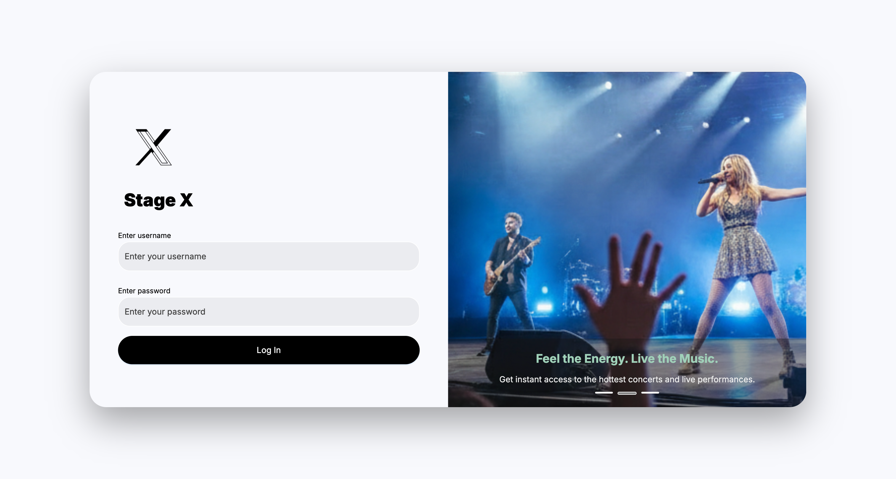
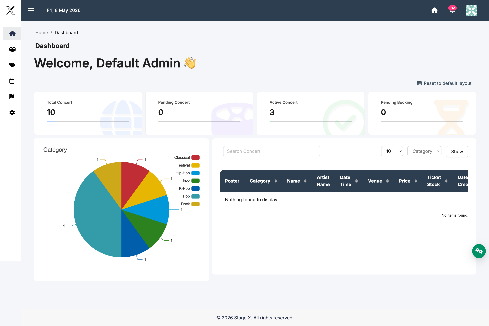
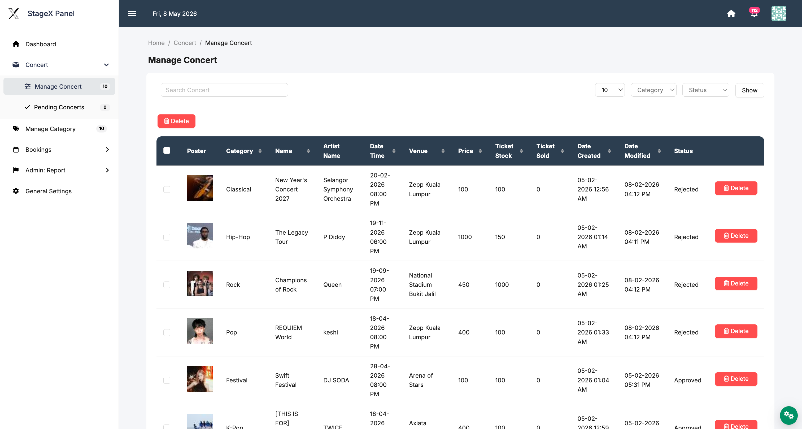
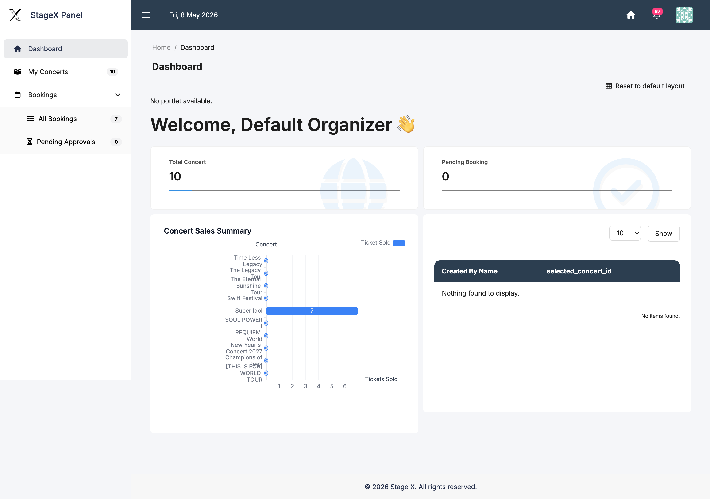
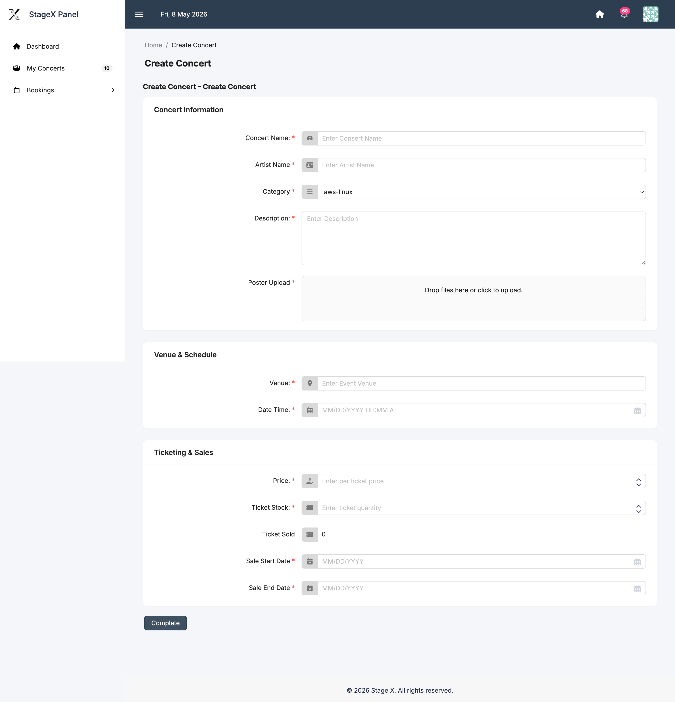
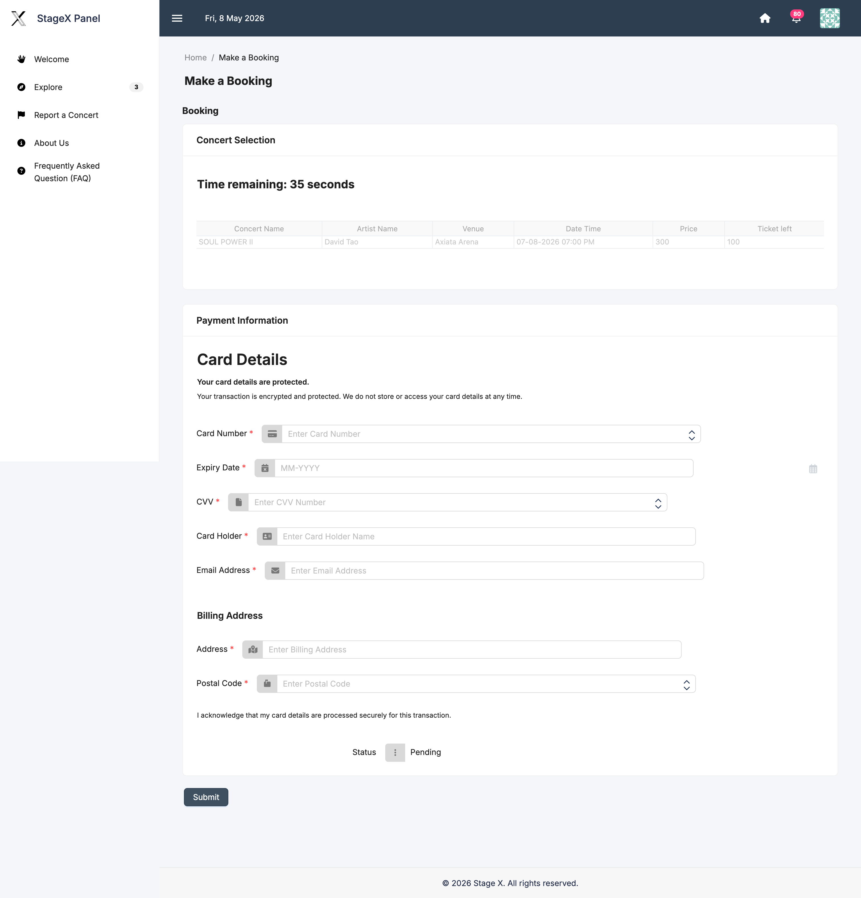
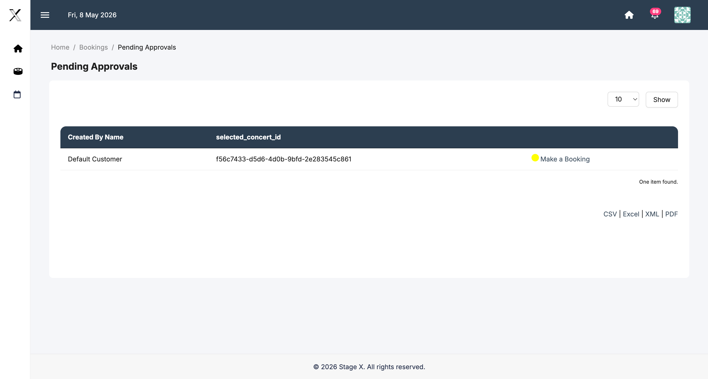
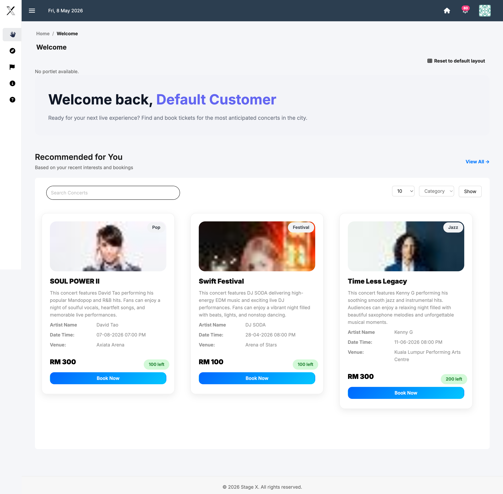

  
   
  <h1>StageX — Concert Ticketing System</h1>
  
<strong>Academic low-code development project using Joget to build a concert ticketing management system.</strong>

  

    
    
    
  

> StageX is a web-based concert ticketing and event management system developed using the Joget Low-Code Development Platform.
>
> The system centralizes concert creation, approval workflows, booking management, and ticket handling into a single platform for Admins, Organizers, and Customers. 

## ✨ Key Features

### Role-Based Access Control
- Admin — Full system control
- Organizer — Event & booking management
- Customer — Ticket purchasing
- Guest — Explore concerts

### Concert Management
- Create and edit concert events
- Admin approval workflow
- Concert category management
- Automated sold-out status

### Booking System
- Concert ticket booking and reservations
- Pending booking approvals
- Automated ticket stock updates after approval
- Booking confirmation and rejection emails

### Input Validation
- Credit card validation
- CVV validation
- Email format validation
- Postal code validation
- Date validation for event sales

### Workflow Automation
- Automated approval processes
- Reminder email notifications
- Booking workflow routing
- Role-based task assignments

## 🛠️ Technologies & Tools

- Joget DX (Low-Code Platform)
- Workflow Automation
- Joget Process Builder
- Form Builder
- List Builder
- HTML/CSS
- Email Tool Configuration

## 📦 System Modules

### Admin
- Dashboard
- Manage Concerts
- Manage Categories
- Booking Approvals
- FAQ Management
- Reports & Analytics

### Organizer
- Create Concert
- Edit Concert
- Manage Concerts
- Review Customer Bookings

### Customer
- Explore Concerts
- Book Tickets
- View FAQs
- Submit Reports

## 🔄 Workflow Overview

### Concert Approval Workflow
1. Organizer submits a new concert event.
2. Admin reviews the submission.
3. Approval or rejection email is sent automatically.
4. Approved concerts become public on the Explore page.

### Booking Workflow
1. Customer submits a booking request.
2. Organizer reviews the booking.
3. System updates ticket availability after approval.
4. Confirmation email is sent to the customer.

## 📸 System Screenshots

| Module | Preview |
|---|---|
| **Login Page** |  |
| **Admin Dashboard** |  |
| **Manage Concerts** |  |
| **Organizer Dashboard** |  |
| **Create Concert** |  |
| **Concert Booking** |  |
| **Approval Workflow** |  |
| **Explore Page** |  |

## 🎓 Academic Project

Developed for:

**AAPP016-4-2 DevOps and Low Code Development**  
Asia Pacific University of Technology & Innovation (APU)

## 🚀 How to Import & Run

1. Install and run Joget DX.
2. Log in to the Joget App Center as an administrator.
3. Navigate to **Design New App** → **Import App**.
4. Upload the provided `.jwa` file from the repository releases.
5. Launch the application from the App Center.

## 👨‍💻 Contributors

Made by Group 20.

